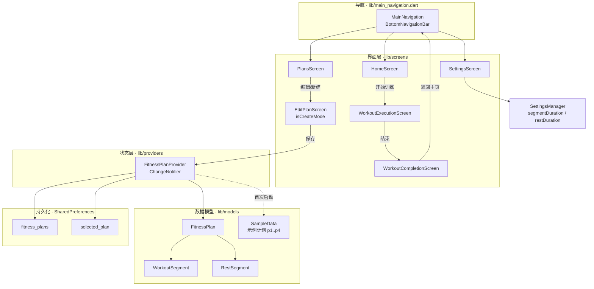
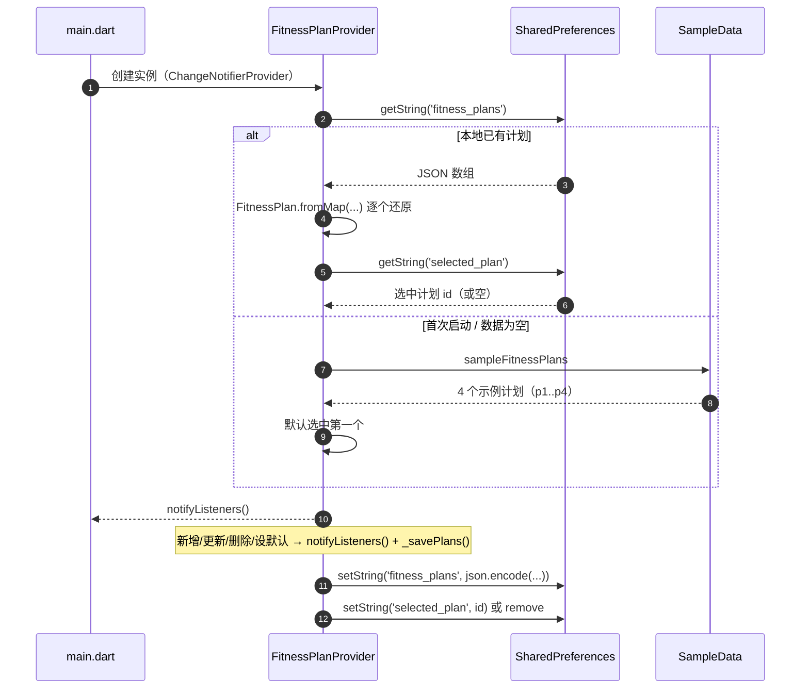
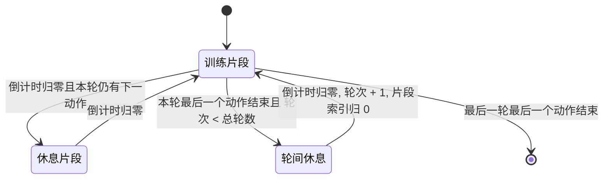
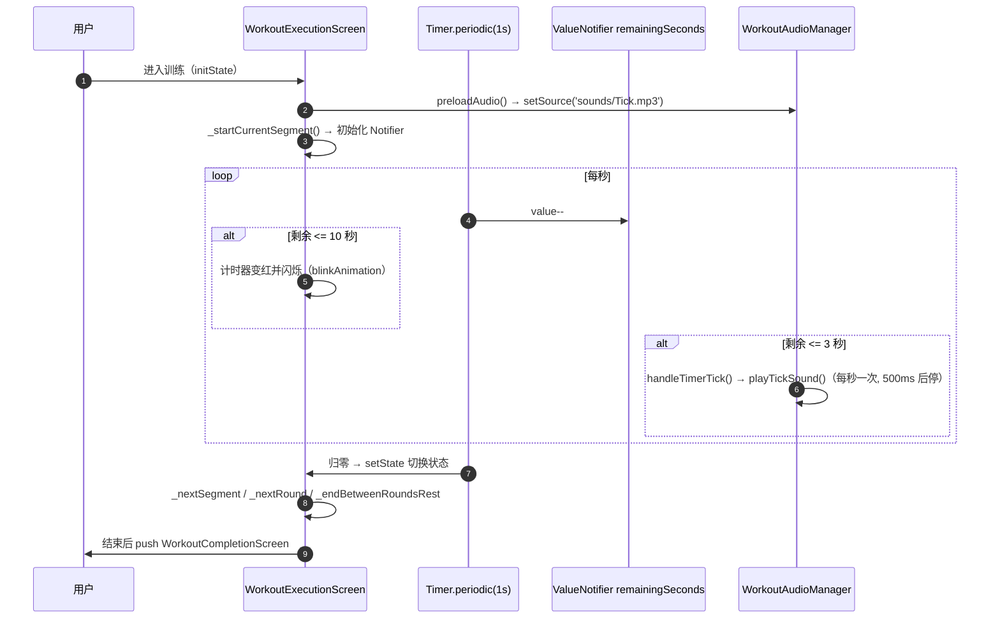
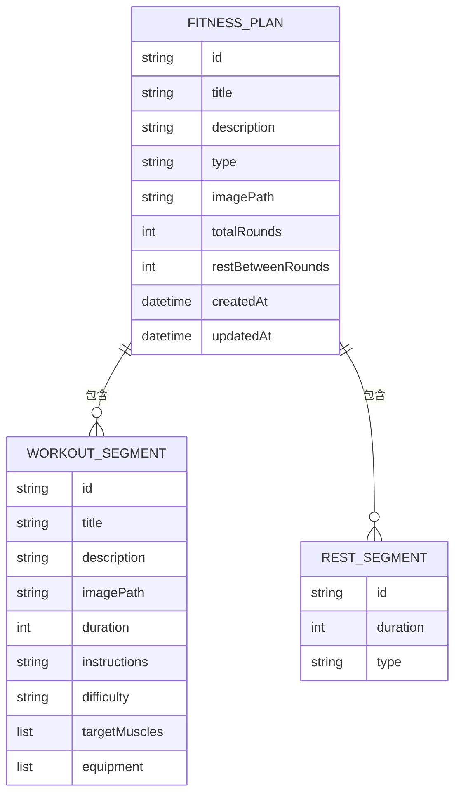

<div align="center">

> [English](./README_en.md) | **简体中文**


# FlowFit — 自定义健身计划与离线训练计时器

**把你编排的「动作 → 休息 → 轮数」变成一串自动倒计时 —— 全程离线、无需会员、随时开练。**


</div>

---

## 它解决什么问题

市面上的健身 App 大多有两道坎：要么把计划锁在会员墙后，要么只让你练它预设好的课程。可当你只想练自己编排的一组动作——比如「深蹲 45 秒 → 休息 20 秒，循环 3 轮，轮间歇 60 秒」——往往只能对着手机手动掐表。

**FlowFit 让你把训练编排成可复用的「计划」，练的时候交给它自动倒计时。** 每个计划由「训练片段 + 休息片段 + 总轮数 + 轮间休息」拼装而成；执行时全屏大字计时、进度条、最后 10 秒闪烁、最后 3 秒滴答提示音，练完自动进入结算页展示本场数据。

> 所有数据只写在本机 `SharedPreferences`，**App 不联网、不上传**。

---

## ✨ 功能

- 🏗️ **可视化编排训练流程**：增删训练片段、逐个设置动作名/描述/时长，休息片段随训练片段自动生成。
- 🖱️ **拖拽重排 / 复制 / 删除**：在流程图预览里拖动方块换顺序，拖到「复制区」就地复制，拖到「删除区」二次确认后删除。
- ⏱️ **全屏训练执行**：大号倒计时、按轮次与片段的进度；**训练(绿) / 休息(橙) / 轮间(紫)** 三态配色，进入最后 10 秒计时器变红并闪烁。
- 🔔 **倒计时提示音**：片段归零前 3 秒播放 `Tick.mp3`（预加载 + 低延迟模式，防重复）。
- 📋 **计划库与默认计划**：网格自适应 1/2/3 列，一键把某个计划设为默认（首页「开始训练」直接用它）。
- 🖼️ **动作配图**：从相册选图（自动压缩到 800×800、质量 80）作为动作示意。
- 💾 **本地持久化**：计划列表、默认计划、默认时长全部落地 `SharedPreferences`，冷启动即恢复。
- 📱 **全平台 + 响应式**：Android / iOS / Web / macOS / Linux / Windows；按屏宽切换断点，同一套代码适配手机与大屏。
- 🎉 **训练结算**：交错动画展示总时长、完成轮数、训练片段数与本计划详情。

---

## 🚀 快速开始

### 方式一：面向 AI Agent（一键安装，推荐）

把下面这段提示词直接发给你的本地 AI Agent（Claude Code / Codex / OpenCode …）：

````markdown
请帮我运行 FlowFit（自定义健身计划 App，GitHub: https://github.com/RayMorTwinkle/custom_fitness_planner）。
背景：这是一个 Flutter 应用，用于创建自定义健身计划并按「动作—休息—轮数」自动倒计时训练。

步骤：
1. 克隆：git clone https://github.com/RayMorTwinkle/custom_fitness_planner.git && cd custom_fitness_planner
2. 确认已装 Flutter（SDK ^3.9.2）：flutter --version
3. 装依赖：flutter pub get
4. 直接运行：flutter run
   （或构建 Android 包：flutter build apk --release）
5. 首次打不开就 flutter doctor 看看缺哪个平台工具链，安装后再试。
6. 运行成功后告诉我：默认会载入 4 个示例计划（全身/上肢/下肢/核心）。
````

### 方式二：面向人类用户

```bash
git clone https://github.com/RayMorTwinkle/custom_fitness_planner.git
cd custom_fitness_planner
flutter pub get
flutter run                    # 连接设备/模拟器直接运行
# 或
flutter build apk --release    # 产出 Android 安装包
```

> **环境要求**：Flutter SDK `^3.9.2`（Dart `^3.9.2`）。Android 侧最低 API 21（Android 5.0）。
> 仓库根目录已附带一份构建产物 `FlowFit-release-20251106.apk`（约 48 MB），可直接侧载体验。

---

## 🖥️ 使用

### 界面与入口

| 入口 | 文件 | 作用 |
|---|---|---|
| 主页 | `lib/screens/home_screen.dart` | 展示**默认计划**卡片 + 「开始训练」按钮 |
| 计划 | `lib/screens/plans_screen.dart` | 计划网格（自适应 1/2/3 列），点卡片设为默认，右上角进入编辑 |
| 设置 | `lib/screens/settings_screen.dart` | 设定**新建片段**的默认时长与默认休息时长 |
| 计划编辑器 | `lib/screens/edit_plan_screen.dart` | 创建（`plan == null`）与编辑复用同一页面，由 `isCreateMode` 区分 |
| 训练执行 | `lib/screens/workout_execution_screen.dart` | 全屏计时、暂停/跳过/退出 |
| 训练完成 | `lib/screens/workout_completion_screen.dart` | 本场结算数据 |

### 典型工作流：编一个计划并开练

```text
1. 计划页 → 点右上角「+」进入计划编辑器
2. 填计划标题/描述、总轮数(默认 3)、轮间休息(默认 60 秒)
3. 逐个配置训练片段：动作名、描述、时长（默认取设置页的 45 秒）
   —— 休息片段会按「片段数 - 1」自动生成，可在卡片里改时长
4. 在「流程预览」里拖拽调整顺序（也可拖到复制区/删除区）
5. 保存 → 回到计划页，点该卡片把它设为默认
6. 主页 →「开始训练」→ 倒计时；结束后看结算页
```

### 设置项（`SettingsManager`，`lib/utils/settings_manager.dart`）

| 键 | 含义 | 默认值 | 滑块范围 |
|---|---|---|---|
| `segmentDuration` | 新建训练片段的默认时长（秒） | `45.0` | 20–120 |
| `restDuration` | 新建休息片段的默认时长（秒） | `20.0` | 10–100 |

---

## 🏗️ 架构

### 1. 系统总览

三层结构：`screens`（界面）→ `providers`（状态）→ `models`（数据）+ `shared_preferences`（持久化）。导航由 `MainNavigation` 的底部栏承载。



### 2. 计划数据的载入、保存与筛选

`FitnessPlanProvider` 构造时即 `_loadPlans()`：优先读 `SharedPreferences`，无数据则回退到 `SampleData`；任何写操作都会 `notifyListeners()` 并落盘。



### 3. 训练执行状态机

单个计划按「训练片段 → 休息片段」交替推进；一轮的最后一个动作后若还有下一轮，则进入**轮间休息**，否则结算。



### 4. 训练计时与提示音时序

计时器每秒 `Timer.periodic` 递减 `ValueNotifier`，仅让监听它的头部/内容重建；只有切换片段这类低频事件才走 `setState`。



### 5. 数据模型

一个 `FitnessPlan` 持有若干 `WorkoutSegment` 与 `RestSegment`；休息片段数量在编辑器里等于「训练片段数 - 1」。



---

## 📂 目录结构

```text
custom_fitness_planner/
├── lib/
│   ├── main.dart                       # 入口：Material3 主题 + MultiProvider
│   ├── main_navigation.dart            # 底部导航（主页 / 计划 / 设置）
│   ├── models/
│   │   ├── fitness_plan.dart           # FitnessPlan + PlanType 枚举
│   │   ├── workout_segment.dart        # WorkoutSegment + 难度/肌群/器材枚举
│   │   ├── rest_segment.dart           # RestSegment + RestType 枚举
│   │   └── sample_data.dart            # 内置示例计划 p1..p4
│   ├── providers/
│   │   └── fitness_plan_provider.dart  # 计划 CRUD / 默认计划 / 持久化 / 搜索统计
│   ├── screens/
│   │   ├── home_screen.dart            # 首页：默认计划 + 开始训练
│   │   ├── plans_screen.dart           # 计划网格 + 设为默认 + 编辑入口
│   │   ├── edit_plan_screen.dart       # 创建/编辑计划（isCreateMode 复用）
│   │   ├── workout_execution_screen.dart    # 训练执行（计时状态机）
│   │   ├── workout_completion_screen.dart   # 训练结算
│   │   └── settings_screen.dart        # 默认时长设置
│   ├── utils/
│   │   └── settings_manager.dart       # 读写默认时长
│   └── widgets/
│       ├── edit_plan/                  # 编辑相关卡片 + 流程预览(拖拽) + 流程构建器
│       └── workout_execution/          # header / content / controls / audio_player
├── assets/
│   ├── images/FlowFItIcon.png          # 应用图标（同时用于生成各平台图标）
│   ├── sounds/Tick.mp3                 # 倒计时提示音
│   └── logo.svg                        # README / 仓库展示图标
├── android/ ios/ web/ macos/ linux/ windows/   # Flutter 各平台工程
├── docs/PROJECT_STRUCTURE.md           # 早期项目结构说明（部分内容已过时，见下）
├── pubspec.yaml                        # 依赖与图标生成配置
└── FlowFit-release-20251106.apk        # 预构建 Android 安装包（约 48 MB）
```

---

## 🔧 技术细节

**状态管理。** `FitnessPlanProvider` 继承 `ChangeNotifier`，通过 `MultiProvider` 注入。列表用 `Consumer` 获取；计划卡片用 `Selector<FitnessPlanProvider, bool>` 只订阅 `isDefaultPlan(plan)`，避免整表重建。

**持久化键（真实字符串）。**

| 存储 | 键 | 值 |
|---|---|---|
| `SharedPreferences` | `fitness_plans` | 整个计划列表的 JSON 数组 |
| `SharedPreferences` | `selected_plan` | 默认计划的 `id` |
| `SharedPreferences` | `segmentDuration` | `double`，新建训练片段默认时长 |
| `SharedPreferences` | `restDuration` | `double`，新建休息片段默认时长 |

**时长计算。** `FitnessPlan.totalWorkoutDuration`（秒）=
`(Σ 训练片段时长 + Σ 休息片段时长) × totalRounds + restBetweenRounds × (totalRounds − 1)`。
最后一轮之后不计轮间休息。

**执行期性能。** 高频的倒计时与累计时长分别放进 `ValueNotifier<int>` 和 `ValueNotifier<Duration>`，用 `ValueListenableBuilder` 局部重建；Timer 内不再 `setState`，仅在切换片段/轮次时 `setState`。

**提示音逻辑。** 单例 `WorkoutAudioPlayer` / `WorkoutAudioManager`，音频 `AssetSource('sounds/Tick.mp3')`、音量 `0.7`、`ReleaseMode.stop`。`handleTimerTick` 在剩余 `≤ 3` 秒时逐秒播放，用 `_lastPlayedSecond` 去重；每次播放 500ms 后自动 `stop()` 防止叠加。

**动画。** 剩余 `≤ 10` 秒计时器变红并做 `0.3 ↔ 1.0` 的呼吸闪烁（`AnimationController` 500ms，`reverse`）；标题/图片/数字切换用 `AnimatedSwitcher` 淡入淡出。

**配图压缩。** `ImagePicker().pickImage(source: gallery, maxWidth: 800, maxHeight: 800, imageQuality: 80)`，路径存入 `WorkoutSegment.imagePath`，执行页用 `Image.file` 展示。

**编辑器约束。** 训练片段最多 **20** 个，至少保留 **1** 个（`canDelete = workoutSegments.length > 1`）；新建计划 `id = DateTime.now().millisecondsSinceEpoch`，`type` 固定为 `'custom'`。

**主题与配色。** Material 3，`ColorScheme.fromSeed(seedColor: Color(0xFF4CAF50))`；卡片圆角 16 / elevation 4，按钮圆角 12。执行态配色：训练 `#4CAF50`、休息 `#FF9800`、轮间 `#9C27B0`。

**响应式断点。** 首页/设置/编辑器：`< 600` 小屏、`600–1024` 中屏、`≥ 1024` 大屏；计划页：`< 500 / 500–1200 / ≥ 1200` 对应 **1 / 2 / 3** 列；执行页：`< 600`、`600–800`、`≥ 800`（大屏改为左图右文布局）。

---

## ❓ 常见问题

**Q：数据存在哪里？会联网吗？**
A：只存在本机 `SharedPreferences`；App 无任何网络请求。

**Q：为什么首次打开就有 4 个计划？**
A：当 `fitness_plans` 为空时，Provider 会载入 `SampleData.sampleFitnessPlans`（全身/上肢/下肢/核心），方便直接体验；一旦你自己增删改，就会以本地数据为准。

**Q：新建的休息片段在哪设置？**
A：休息片段不由你单独添加，而是按「训练片段数 − 1」自动生成（相邻两个动作之间一段），在流程卡片里改各自时长即可。

**Q：想练单动作多轮怎么配？**
A：只保留 1 个训练片段（此时没有休息片段），把「总轮数」设大，再设轮间休息，即可做「动作 → 轮间休息」循环。

**Q：计时器最后为什么会变红、有滴答声？**
A：剩余 ≤ 10 秒计时器变红并闪烁；剩余 ≤ 3 秒逐秒播放 `sounds/Tick.mp3` 提醒。

**Q：`docs/PROJECT_STRUCTURE.md` 里的文件树和实际对不上？**
A：该文档是早期版本，引用的 `create_plan_screen.dart`、`widgets/create_plan/` 已不存在；当前创建与编辑统一为 `EditPlanScreen`（`isCreateMode`）与 `widgets/edit_plan/`。**以本 README 与源码为准。**

---

## ⚠️ 注意事项

- **未附带测试**：仓库没有 `test/` 目录，改动后请自行验证。（待确认是否有 CI）
- **命名路由未注册**：`home_screen.dart` 在空计划态用 `pushNamed(context, '/plans')`、`workout_completion_screen.dart` 用 `pushNamedAndRemoveUntil('/', ...)`，但 `MaterialApp` 未声明 `routes`/`onGenerateRoute`，这两处跳转可能抛错（待确认）。
- **资源目录声明**：`pubspec.yaml` 声明了 `assets/icons/`，但当前仓库无该目录；若 `flutter build`/`pub get` 报「找不到资源目录」，需补建空目录或移除该声明（待确认）。
- **`assets/fonts/` 与部分文档描述**为规划内容，当前未实际使用。
- **文档漂移**：`docs/PROJECT_STRUCTURE.md` 与 `README` 的旧版本描述已落后于代码，本仓库已用本文档替换根 `README.md`。
- 预构建 APK 为一次性产物，版本与最新源码可能不同步。

---

## 📄 License

本仓库当前**未附带开源许可证文件**。若需对外分发或允许他人使用，建议补充一个许可证（如 MIT）；在此之前，默认保留所有权利。

---

## 🙏 致谢 / Credits

- 应用图标 `assets/images/FlowFItIcon.png` 为 **豆包 AI 生成**的图片。
- 倒计时提示音 `assets/sounds/Tick.mp3` 为项目自带音效素材。
- 本项目为原创应用；README（中英双语）、`assets/logo.svg` 与架构图为本仓库重制。

---

<div align="center">
<sub>FlowFit · 把自律交给倒计时，你只管动起来</sub>
</div>
