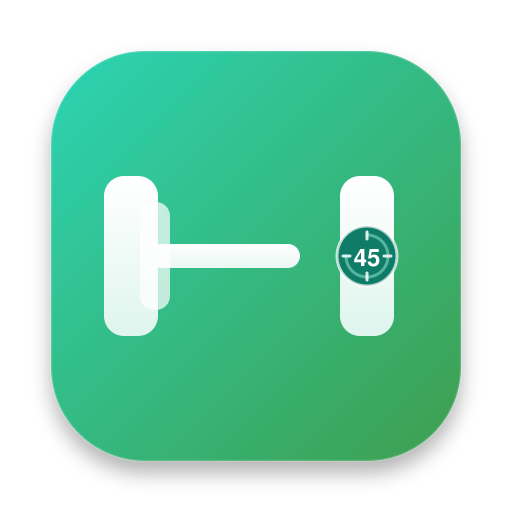
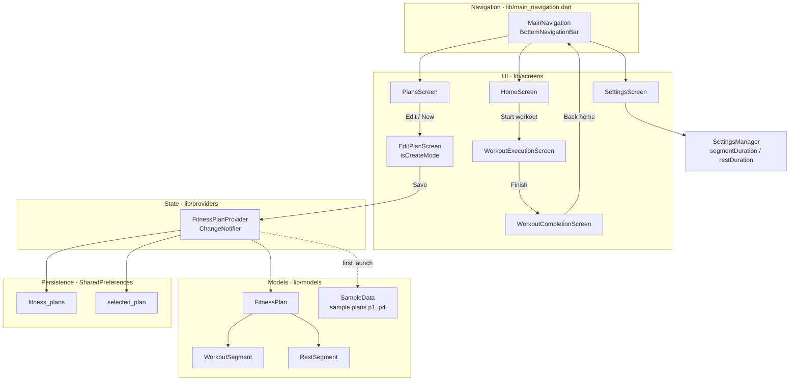
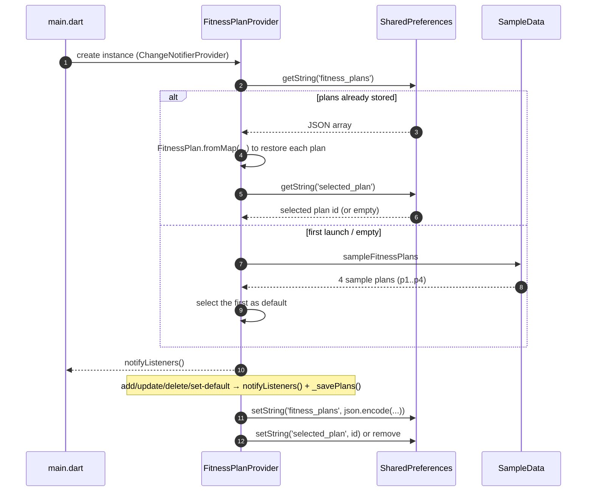
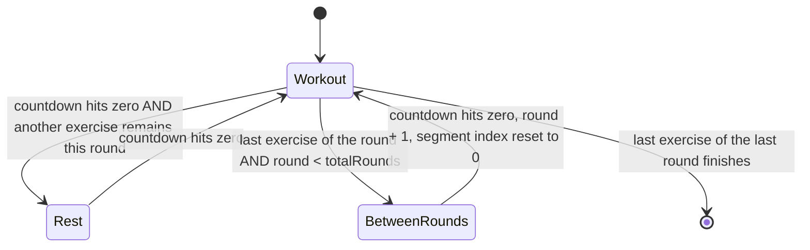
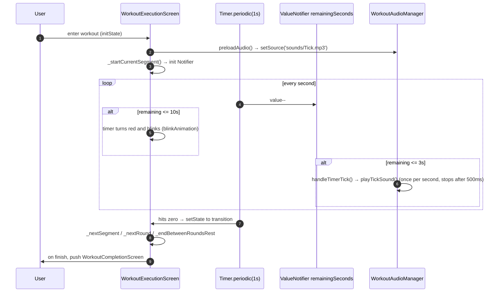
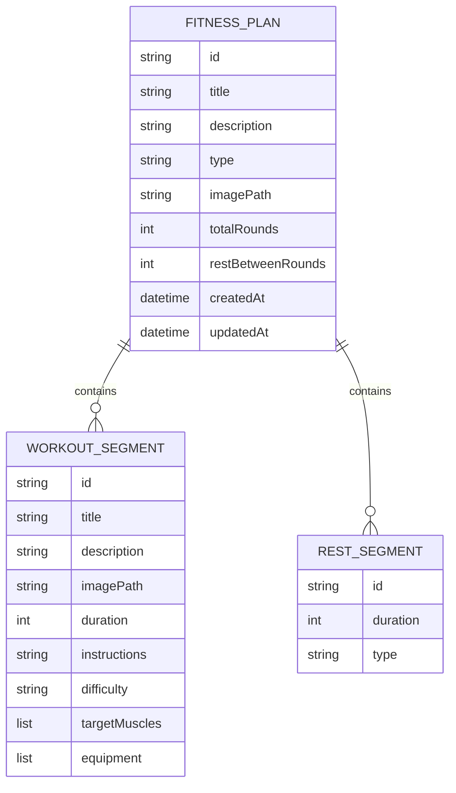

<div align="center">

> **English** | [简体中文](./README.md)



# FlowFit — Custom Workout Plans with an Offline Interval Timer

**Turn the routine you design — "work → rest → rounds" — into an automatic countdown. Fully offline, no membership, start any time.**


</div>

---

## Why it exists

Most fitness apps put up two barriers: plans are locked behind a membership wall, or you can only follow their pre-made classes. But when you just want to run your own arrangement — say "squat 45s → rest 20s, 3 rounds, 60s between rounds" — you're stuck timing it by hand on your phone.

**FlowFit lets you compose a workout into a reusable "plan", and it handles the countdown while you train.** Each plan is assembled from workout segments, rest segments, a round count and the inter-round rest. During execution you get a full-screen countdown, a progress bar, a blink in the last 10 seconds, a tick sound in the last 3 seconds, and a summary screen when it's over.

> Everything is written only to the local `SharedPreferences`. **The app makes no network requests and uploads nothing.**

---

## ✨ Features

- 🏗️ **Visual flow builder**: add/remove workout segments, set each one's name/description/duration; rest segments are generated automatically from the workout segments.
- 🖱️ **Drag to reorder / copy / delete**: reorder blocks in the flow preview, drop onto the "copy" zone to duplicate, or onto the "delete" zone to remove (with confirmation).
- ⏱️ **Full-screen execution**: a large countdown plus progress by round and segment; **workout (green) / rest (orange) / between-rounds (purple)** states, turning red and blinking in the final 10 seconds.
- 🔔 **Countdown chime**: plays `Tick.mp3` in the last 3 seconds of a segment (preloaded, low-latency, de-duplicated).
- 📋 **Plan library & default plan**: an adaptive 1/2/3-column grid; set any plan as default to start it straight from Home.
- 🖼️ **Exercise images**: pick a photo from the gallery (compressed to 800×800, quality 80) as a visual cue.
- 💾 **Local persistence**: plans, the default plan and default durations all live in `SharedPreferences` and survive a cold start.
- 📱 **Cross-platform + responsive**: Android / iOS / Web / macOS / Linux / Windows; responsive breakpoints adapt one codebase to phones and large screens.
- 🎉 **Workout summary**: a staggered animation showing total time, completed rounds, workout-segment count and plan details.

---

## 🚀 Quick Start

### Option 1 — For AI agents (one-shot install, recommended)

Paste this prompt into your local AI agent (Claude Code / Codex / OpenCode …):

````markdown
Please run FlowFit (a custom workout-plan app, GitHub: https://github.com/RayMorTwinkle/custom_fitness_planner).
Context: it's a Flutter app for building custom workout plans and training with an automatic
"work → rest → rounds" countdown.

Steps:
1. Clone: git clone https://github.com/RayMorTwinkle/custom_fitness_planner.git && cd custom_fitness_planner
2. Make sure Flutter is installed (SDK ^3.9.2): flutter --version
3. Install deps: flutter pub get
4. Run it: flutter run
   (or build an Android package: flutter build apk --release)
5. If it won't start, run flutter doctor and install the missing platform toolchain.
6. Once running, tell me: it loads 4 sample plans by default (full-body / upper / lower / core).
````

### Option 2 — For humans

```bash
git clone https://github.com/RayMorTwinkle/custom_fitness_planner.git
cd custom_fitness_planner
flutter pub get
flutter run                    # run directly on a device/simulator
# or
flutter build apk --release    # produce an Android package
```

> **Requirements**: Flutter SDK `^3.9.2` (Dart `^3.9.2`). Android minSdk is API 21 (Android 5.0).
> The repo also ships a prebuilt `FlowFit-release-20251106.apk` (~48 MB) you can sideload.

---

## 🖥️ Usage

### Screens and entry points

| Entry | File | Purpose |
|---|---|---|
| Home | `lib/screens/home_screen.dart` | Shows the **default plan** card + "Start workout" |
| Plans | `lib/screens/plans_screen.dart` | Plan grid (adaptive 1/2/3 columns); tap a card to set default, edit from the corner |
| Settings | `lib/screens/settings_screen.dart` | Set the default duration for **new segments** and default rest |
| Plan editor | `lib/screens/edit_plan_screen.dart` | Create (`plan == null`) and edit share one screen, split by `isCreateMode` |
| Execution | `lib/screens/workout_execution_screen.dart` | Full-screen timer with pause / skip / exit |
| Summary | `lib/screens/workout_completion_screen.dart` | Post-workout stats |

### Typical workflow: build a plan and train

```text
1. Plans screen → tap "+" in the corner to open the editor
2. Fill in title/description, total rounds (default 3), inter-round rest (default 60s)
3. Configure each workout segment: name, description, duration (defaults to the 45s in Settings)
   — rest segments are auto-generated as "segments − 1"; edit each duration on its card
4. In the "flow preview", drag blocks to reorder (or drop onto copy/delete zones)
5. Save → back on the Plans screen, tap the card to make it the default
6. Home → "Start workout" → countdown; review the summary when finished
```

### Settings (`SettingsManager`, `lib/utils/settings_manager.dart`)

| Key | Meaning | Default | Slider range |
|---|---|---|---|
| `segmentDuration` | Default duration for new workout segments (seconds) | `45.0` | 20–120 |
| `restDuration` | Default duration for new rest segments (seconds) | `20.0` | 10–100 |

---

## 🏗️ Architecture

### 1. System overview

Three layers: `screens` (UI) → `providers` (state) → `models` (data) + `shared_preferences` (persistence). Navigation lives in `MainNavigation`'s bottom bar.



### 2. Loading, saving and filtering plan data

`FitnessPlanProvider` calls `_loadPlans()` in its constructor: it reads `SharedPreferences` first and falls back to `SampleData`; any write calls `notifyListeners()` and persists.



### 3. Execution state machine

A plan advances by alternating "workout segment → rest segment"; after the last exercise of a round it enters **between-rounds rest** if more rounds remain, otherwise it finishes.



### 4. Timer and chime sequence

`Timer.periodic` ticks every second and decrements a `ValueNotifier`; only the header/content that listen to it rebuild. Low-frequency transitions (segment switches) use `setState`.



### 5. Data model

A `FitnessPlan` holds several `WorkoutSegment`s and `RestSegment`s; the editor keeps rest segments equal to "workout segments − 1".



---

## 📂 Project layout

```text
custom_fitness_planner/
├── lib/
│   ├── main.dart                       # Entry: Material 3 theme + MultiProvider
│   ├── main_navigation.dart            # Bottom nav (Home / Plans / Settings)
│   ├── models/
│   │   ├── fitness_plan.dart           # FitnessPlan + PlanType enum
│   │   ├── workout_segment.dart        # WorkoutSegment + difficulty/muscle/equipment enums
│   │   ├── rest_segment.dart           # RestSegment + RestType enum
│   │   └── sample_data.dart            # Built-in sample plans p1..p4
│   ├── providers/
│   │   └── fitness_plan_provider.dart  # CRUD / default plan / persistence / search & stats
│   ├── screens/
│   │   ├── home_screen.dart            # Home: default plan + start workout
│   │   ├── plans_screen.dart           # Plan grid + set-default + edit entry
│   │   ├── edit_plan_screen.dart       # Create/edit plan (shared via isCreateMode)
│   │   ├── workout_execution_screen.dart    # Execution (timer state machine)
│   │   ├── workout_completion_screen.dart   # Summary
│   │   └── settings_screen.dart        # Default durations
│   ├── utils/
│   │   └── settings_manager.dart       # Read/write default durations
│   └── widgets/
│       ├── edit_plan/                  # Editor cards + drag-drop flow preview + flow builder
│       └── workout_execution/          # header / content / controls / audio_player
├── assets/
│   ├── images/FlowFItIcon.png          # App icon (also used to generate platform icons)
│   ├── sounds/Tick.mp3                 # Countdown chime
│   └── logo.svg                        # README / repo display icon
├── android/ ios/ web/ macos/ linux/ windows/   # Flutter platform projects
├── docs/PROJECT_STRUCTURE.md           # Early structure doc (partly outdated, see below)
├── pubspec.yaml                        # Dependencies and icon-generation config
└── FlowFit-release-20251106.apk        # Prebuilt Android package (~48 MB)
```

---

## 🔧 Technical notes

**State management.** `FitnessPlanProvider` extends `ChangeNotifier` and is injected via `MultiProvider`. The list is read with `Consumer`; each plan card uses `Selector<FitnessPlanProvider, bool>` to subscribe only to `isDefaultPlan(plan)`, avoiding whole-grid rebuilds.

**Persistence keys (real strings).**

| Store | Key | Value |
|---|---|---|
| `SharedPreferences` | `fitness_plans` | JSON array of the whole plan list |
| `SharedPreferences` | `selected_plan` | `id` of the default plan |
| `SharedPreferences` | `segmentDuration` | `double`, default duration for new workout segments |
| `SharedPreferences` | `restDuration` | `double`, default duration for new rest segments |

**Duration math.** `FitnessPlan.totalWorkoutDuration` (seconds) =
`(Σ workout durations + Σ rest durations) × totalRounds + restBetweenRounds × (totalRounds − 1)`.
No inter-round rest is counted after the final round.

**Runtime performance.** The high-frequency countdown and accumulated duration live in `ValueNotifier<int>` and `ValueNotifier<Duration>` and rebuild locally via `ValueListenableBuilder`; the `Timer` no longer calls `setState`, which only happens on segment/round transitions.

**Chime logic.** Singleton `WorkoutAudioPlayer` / `WorkoutAudioManager` play `AssetSource('sounds/Tick.mp3')` at volume `0.7` with `ReleaseMode.stop`. `handleTimerTick` plays once per second for the last `≤ 3` seconds, de-duplicated via `_lastPlayedSecond`; each tick auto-`stop()`s after 500 ms to avoid overlap.

**Animations.** In the last `≤ 10` seconds the timer turns red and breathes between `0.3 ↔ 1.0` (`AnimationController` 500 ms, `reverse`); titles/images/numbers cross-fade with `AnimatedSwitcher`.

**Image compression.** `ImagePicker().pickImage(source: gallery, maxWidth: 800, maxHeight: 800, imageQuality: 80)`; the path is stored in `WorkoutSegment.imagePath` and shown via `Image.file`.

**Editor constraints.** At most **20** workout segments, at least **1** (`canDelete = workoutSegments.length > 1`); new plans get `id = DateTime.now().millisecondsSinceEpoch` and a fixed `type` of `'custom'`.

**Theme and colors.** Material 3 with `ColorScheme.fromSeed(seedColor: Color(0xFF4CAF50))`; cards use radius 16 / elevation 4, buttons radius 12. Runtime state colors: workout `#4CAF50`, rest `#FF9800`, between-rounds `#9C27B0`.

**Responsive breakpoints.** Home/Settings/editor: `< 600` small, `600–1024` medium, `≥ 1024` large; Plans: `< 500 / 500–1200 / ≥ 1200` → **1 / 2 / 3** columns; Execution: `< 600`, `600–800`, `≥ 800` (large switches to a side-by-side image/text layout).

---

## ❓ FAQ

**Q: Where is data stored? Does it go online?**
A: Only in local `SharedPreferences`; the app makes no network requests.

**Q: Why are there 4 plans on first launch?**
A: When `fitness_plans` is empty, the provider loads `SampleData.sampleFitnessPlans` (full-body / upper / lower / core) so you can try it immediately. Once you make any change, your local data takes over.

**Q: Where do I add rest segments?**
A: You don't add them individually — they're auto-generated as "workout segments − 1" (one between adjacent exercises). Just edit each duration on its flow card.

**Q: How do I do a single exercise for multiple rounds?**
A: Keep exactly 1 workout segment (then there are no rest segments), raise "total rounds", and set the inter-round rest to loop "exercise → inter-round rest".

**Q: Why does the timer turn red and tick at the end?**
A: In the last ≤ 10 seconds it turns red and blinks; in the last ≤ 3 seconds it plays `sounds/Tick.mp3` once per second.

**Q: `docs/PROJECT_STRUCTURE.md` doesn't match the code.**
A: That doc is an early version; the referenced `create_plan_screen.dart` and `widgets/create_plan/` no longer exist. Creation and editing are unified into `EditPlanScreen` (`isCreateMode`) and `widgets/edit_plan/`. **Treat this README and the source as authoritative.**

---

## ⚠️ Notes

- **No tests**: the repo has no `test/` directory, so verify changes manually. (CI status: unconfirmed)
- **Unregistered named routes**: `home_screen.dart` uses `pushNamed(context, '/plans')` in the empty state and `workout_completion_screen.dart` uses `pushNamedAndRemoveUntil('/', ...)`, but `MaterialApp` declares no `routes`/`onGenerateRoute`, so those navigations may throw. (unconfirmed)
- **Asset directories**: `pubspec.yaml` declares `assets/icons/`, but the directory is absent; if `flutter build`/`pub get` errors on a missing asset directory, create it or drop the declaration. (unconfirmed)
- **`assets/fonts/`** and parts of the docs are planned but currently unused.
- **Doc drift**: the old `docs/PROJECT_STRUCTURE.md` and previous root README lag behind the code; the root `README.md` has been replaced by this document.
- The prebuilt APK is a point-in-time artifact and may drift from the latest source.

---

## 📄 License

This repository currently ships **no open-source license file**. If you intend to distribute it or let others use it, add a license (e.g., MIT); until then, all rights are reserved.

---

## 🙏 Credits

- The app icon `assets/images/FlowFItIcon.png` is an image generated by **Doubao AI**.
- The countdown chime `assets/sounds/Tick.mp3` is a bundled sound asset.
- This is an original application; the bilingual README, `assets/logo.svg` and architecture diagrams were reworked for this repository.

---

<div align="center">
<sub>FlowFit · Let the countdown handle discipline — you just move</sub>
</div>
